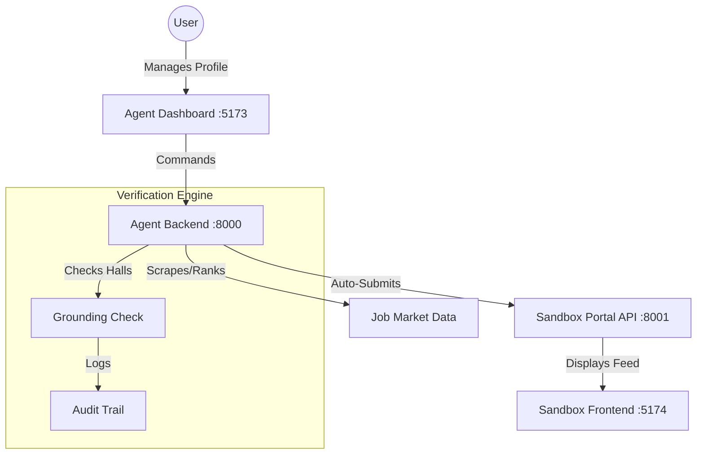

# 🤖 AI Job Impact Agent: Autonomous Career Search

An autonomous full-stack agent that handles the entire job application pipeline—from intelligent market scanning and persona-based ranking to tailored artifact generation and verified auto-submission.

> [!IMPORTANT]
> This project is designed as a demonstration of **Autonomous Agent Capabilities** with built-in **integrity and verification** mechanisms.

---

## 🏗️ Comprehensive Architecture

The system consists of four primary components working in harmony:

1.  **Agent Backend (Port 8000)**: The "Brain" (FastAPI). Handles LLM-powered job ranking, resume tailoring, and the automated batch execution engine.
2.  **Agent Dashboard (Port 5173)**: The "Control Room" (React + Vite). Provides the interface for profile management, job search, and application tracking.
3.  **Sandbox Portal API (Port 8001)**: The "External World". A mock job board API used to safely demonstrate the agent's submission capabilities.
4.  **Sandbox Frontend (Port 5174)**: The "Public Job Board". A visual interface for the sandbox where you can see applications arriving in real-time.



---

## ✨ Core Features

### 1. Autonomous Persona Scaling
Automatically imports master resume data and generates a "Proof Pack"—a structured knowledge base of verified career evidence.

### 2. Intelligent Match Ranking
Unlike simple keyword filters, our agent uses LLMs to perform deep semantic analysis of job descriptions vs. candidate profiles, assigning a multi-factor **Match Score**.

### 3. Real-Time Artifact Tailoring
For every job in the queue, the agent generates:
- **Tailored Resume**: Highlights specific skills relevant to the role.
- **Personalized Cover Letter**: Writes with the candidate's voice and specific job context.
- **Evidence Map**: Prepares a set of verified bullet points for interview prep.

### 4. Grounding & Anti-Hallucination
Every AI-generated sentence is passed through a **Grounding Verification Service**. If the AI tries to "hallucinate" a skill the user doesn't have, the agent rejects the draft and logs the safety failure.

---

## 🚀 Quick Start (Demo Mode)

### One-Command Setup
We provide a standalone demo script that populates the environment and simulates an end-to-end run.

1.  **Initialize Backend**:
    ```bash
    cd backend
    python -m venv venv
    .\venv\Scripts\activate
    pip install -r requirements.txt
    ```
2.  **Run Demo**:
    ```bash
    python scripts/run_demo.py
    ```

### Manual Development Setup

```
.
├── backend/             # FastAPI Agent Backend (Port 8000)
├── frontend/            # React Agent Dashboard (Port 5173)
├── sandbox-portal/      # Mock job portal API (Port 8001)
├── sandbox-frontend/    # Job Board & Admin UI (Port 5174)
├── shared/              # Shared types/schemas
├── docs/                # System Documentation (Inc. Demo Script)
└── docker-compose.yml   # PostgreSQL setup
```

- **Backend**: `uvicorn app.main:app --reload` (Port 8000)
- **Agent Dashboard**: `cd frontend && npm run dev` (Port 5173)
- **Sandbox API**: `cd sandbox-portal && python main.py` (Port 8001)
- **Sandbox UI**: `cd sandbox-frontend && npm run dev` (Port 5174)

---

## � Internal Documentation

- **[Architecture Overview](docs/ARCHITECTURE.md)**: System design and logic flow.
- **[Grounding Safety](docs/GROUNDING_SAFETY.md)**: How we prevent AI hallucinations.
- **[Troubleshooting](docs/TROUBLESHOOTING.md)**: Common setup and runtime issues.
- **[Demo Script](docs/DEMO_SCRIPT.md)**: The 5-minute presentation walkthrough.

---

## ⚖️ License
MIT License. Created for the AI Impact Hackathon 2026.
