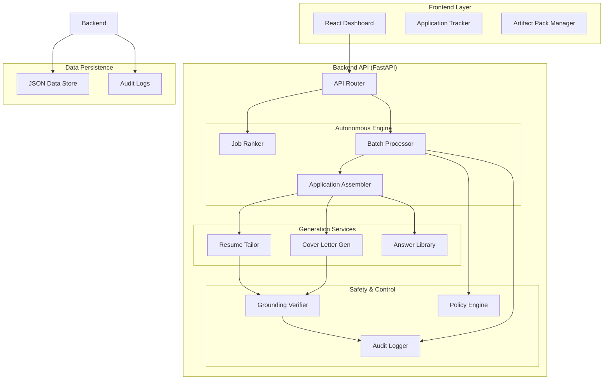
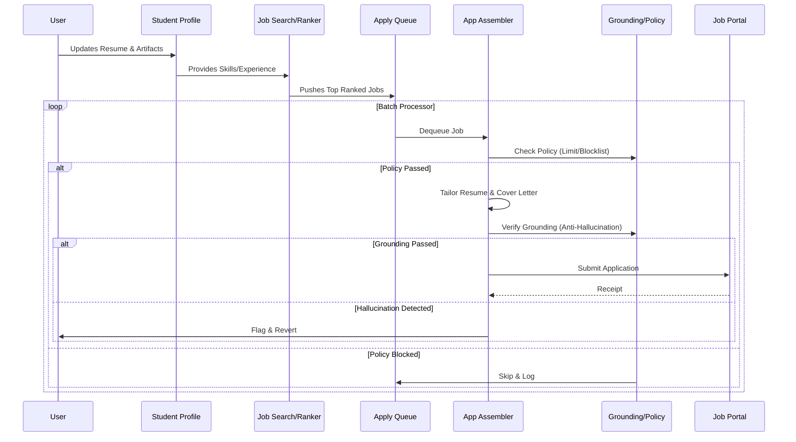

# System Architecture

## Overview
The **AI Job Impact Agent** is an autonomous system designed to scale job applications while maintaining high personalization and safety standards. It employs a micro-service architecture (monorepo) with a React frontend and a FastAPI python backend.

## System Components

## Data Flow Architecture

The data flows through a linear pipeline designed to ensure consistency and personalization.

## Core Subsystems

### 1. Autonomous Engine
- **Job Ranker**: Scores incoming job listings against the student profile using a weighted algorithm (Skills 40%, Experience 30%, Constraints 30%) and LLM-based reasoning.
- **Batch Processor**: A background worker that processes the job queue, respecting rate limits and pacing (slower/faster based on response types).

### 2. Generation & Tailoring
- **Resume Tailor**: Re-orders and rewords existing bullet points (using STAR method) to check keywords from the job description.
- **Answer Library**: Maintains a cache of reusable, modular behavioral answers ("Why this company?", "Strengths") that are dynamically injected.

### 3. Safety Layer
See [GROUNDING_SAFETY.md](./GROUNDING_SAFETY.md) for details on Hallucination prevention and Policy enforcement.

## Technology Stack

| Component | Choice | Rationale |
|-----------|--------|-----------|
| **Backend** | Python (FastAPI) | High performance, native async support for IO-bound submission tasks, rich AI/LLM ecosystem. |
| **Frontend** | React + TypeScript | Type safety, component modularity, and rapid UI development with Tailwind CSS styling. |
| **LLM** | Groq (Llama-3) | Extremely low latency inference essential for "real-time" tailoring of 50+ applications. |
| **Persistence** | Local JSON | Portable, zero-setup data store ideal for single-user autonomous agents. Thread-locked for concurrency. |
| **State** | Zustand | Lightweight global state management for the frontend without the boilerplate of Redux. |
