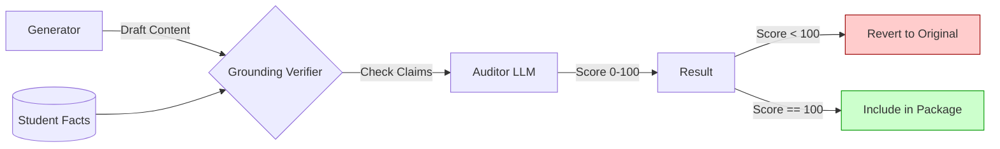

# Grounding & Safety Systems

## Philosophy
Automation without verification is dangerous. The **AI Job Impact Agent** implements a "Trust but Verify" architecture. The system is designed to prevent the AI from "hallucinating" facts, inventing experience, or applying to unsuitable roles.

## 1. Anti-Hallucination (Grounding)

The **Grounding Verifier** is a dedicated service that acts as an auditor for all generated content.

### Mechanism
Every piece of generated text (Resume rewording, Cover Letter) is passed through a verification loop before being accepted.



- **Source of Truth**: The `data/student_profile.json` is treated as immutable fact.
- **Verification Rule**: "Any specific claim (metric, company, skill) in the output MUST be present or reasonably inferred from the Source of Truth."
- **Fallback**: If the AI attempts to "spice up" a bullet point (e.g., adding "Increased revenue by 50%"), the Verifier flags it. The system then **discards the AI change** and falls back to the original, safe bullet point.

## 2. Policy Enforcement

The **Policy Engine** ensures the agent adheres to user-defined constraints, preventing "Application Spam" or applying to restricted companies.

### Constraints
| Policy Type | Description | Action if Violated |
|-------------|-------------|--------------------|
| **Daily Limit** | Maximum applications per 24h window (Default: 50) | `BLOCK` (Stop Batch) |
| **Blocklist** | List of banned company names (e.g., "Revature") | `SKIP` (Job skipped) |
| **Min Match Score** | Minimum alignment score required (Default: 60%) | `SKIP` (Job skipped) |
| **Remote Only** | Enforce remote-only applications | `SKIP` (Non-remote jobs) |
| **Global Kill Switch** | "Pause All" toggle in Dashboard | `HALT` (Immediate Stop) |

## 3. Audit Trail

To ensure full transparency, every autonomous decision is logged in an immutable Audit Log.

### Traceability
Users can inspect the "Chain of Thought" for any application via the Tracker UI.
- **Data Snapshot**: What was the profile state when this app was created?
- **Generation Log**: What exact text did the AI write?
- **Verification Report**: Did it pass grounding? Were any hallucinations caught?
- **Transmission Receipt**: Proof of submission (Timestamp, ID).

```json
// Example Audit Event
{
  "timestamp": "2024-05-20T10:00:00Z",
  "event_type": "verification",
  "step": "Resume Bullet Check",
  "details": {
    "status": "failed",
    "hallucination": "Claimed 'Lead Architect' role not found in profile",
    "action": "Reverted to original text"
  }
}
```

## 4. Execution Safety
- **Rate Limiting**: The batch processor enforces randomized delays (e.g., 5-15s) between applications to behave like a human user and avoid IP bans.
- **Context Isolation**: Each application assembly runs in a fresh context, ensuring data from Job A doesn't bleed into Job B (e.g., wrong company name).
